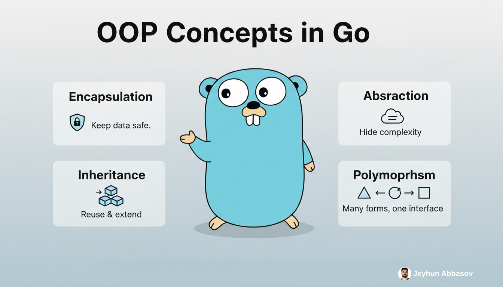

# OOP Concepts in Go: A Practical Guide

This repository demonstrates how Go implements Object-Oriented principles without using traditional classes.



---

## Navigation

| OOP Concept   | Go Implementation                          | Code Example                                                             |
|---------------|--------------------------------------------|--------------------------------------------------------------------------|
| Encapsulation | Exported vs. Unexported (Capitalization)   | [internal/encapsulation/bank.go](internal/encapsulation/bank.go)         |
| Abstraction   | Interfaces (Behavior over Data)            | [internal/abstraction/speech.go](internal/abstraction/speech.go)         |
| Inheritance   | Struct Embedding (Composition)             | [internal/inheritance/vehicle.go](internal/inheritance/vehicle.go)       |
| Polymorphism  | Interface satisfaction (Implicit)          | [internal/polymorphism/geometry.go](internal/polymorphism/geometry.go)   |

---

## Key Takeaways

- **Encapsulation** — Go uses capitalization: exported names (e.g. `Balance`, `Deposit`) are public; unexported names (e.g. `balance`) are package-private. There are no `private`/`public` keywords; visibility is determined by the first character of the identifier.

- **Abstraction** — Go favors small interfaces that describe behavior (e.g. `Speaker` with `Speak()`). Types satisfy interfaces implicitly: if a type has the right methods, it implements the interface without an `implements` declaration.

- **Inheritance** — Go does not have class inheritance. The Go way is **composition over inheritance**: embed structs (e.g. `Engine` inside `Car`) to reuse behavior and data. You model “has a” relationships instead of “is a.”

- **Polymorphism** — Any type that implements an interface’s methods can be used where that interface is expected. Functions accept interfaces (e.g. `Shape`), so you can pass `Circle`, `Square`, or any future shape without changing the function.

---

## Quick Start

```bash
go run main.go
```

You should see a short demo for each of the four OOP concepts.

---

## Project Layout

```
.
├── go.mod
├── main.go
├── README.md
└── internal/
    ├── encapsulation/
    │   └── bank.go
    ├── abstraction/
    │   └── speech.go
    ├── inheritance/
    │   └── vehicle.go
    └── polymorphism/
        └── geometry.go
```
